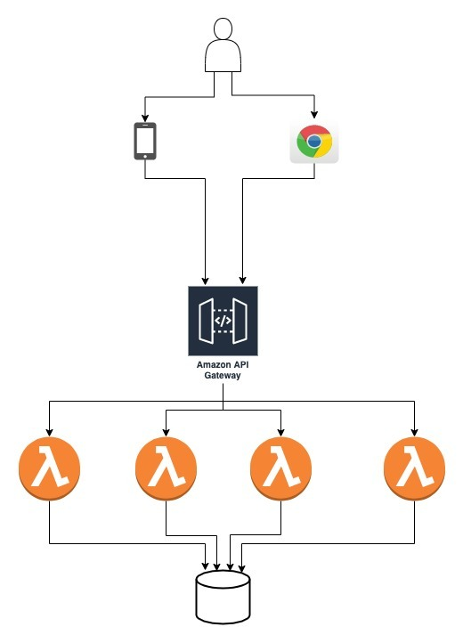

# Rust serverless CDK template

## TODO

This template project is a work in progress

https://rendered-obsolete.github.io/2019/03/19/rust_lambda.html

## Overview

This project contains an example application packaged using the [AWS CDK](https://docs.aws.amazon.com/cdk/latest/guide/cli.html) that deploys an AWS Serverless Web API application using [AWS API Gateway](https://aws.amazon.com/api-gateway/).

Each endpoint gets deployed to a seperate [AWS Lambda](https://aws.amazon.com/lambda/) function which then get exposed via the API Gateway.



The [./openapi.yml](./openapi.yml) file contains the [OpenAPI](https://github.com/OAI/OpenAPI-Specification) Spec for this application.

## Quick start

### Local config files

```sh
# Copy the example .env.local file (used to override environment variables for local development)
cp docs/examples/.env.local .

# Copy the recommended vscode settings to your workspace config
cp .vscode/settings.recommended.json .vscode/settings.json
```

If you are using `direnv` (recommended), copy the `.envrc.example` file and update it with your desired STAGE name (eg. "stableford") and `AWS_PROFILE`. If you have direnv installed it will automatically load project specific config into your shell when entering the project folder.

```sh
cp docs/examples/.envrc .
# edit `.envrc` file to include your own personal STAGE name
direnv allow
direnv reload
```

### Run development scripts

```sh
# use version of NodeJS specified by project
nvm use;

# Install project dependencies (installs dependencies and tools)
make deps.install;

# Run code verification (static analysis, linting etc)
make verify;

# Start local devstack dependencies (Postgres and PgAdmin)
make devstack.start;

# Run tests (some tests rely on having the DB running)
make test;

# Run the dev server (deploys some remote infra to AWS but executes the functions on your local machine).
make dev.start;
```

At this point you should have a development version of this API project running that you can make API requests to from Postman 🎉.

### Next steps

- [./docs/setup-database.md](./docs/setup-database.md)
- [./docs/setup-postman.md](./docs/setup-postman.md)
